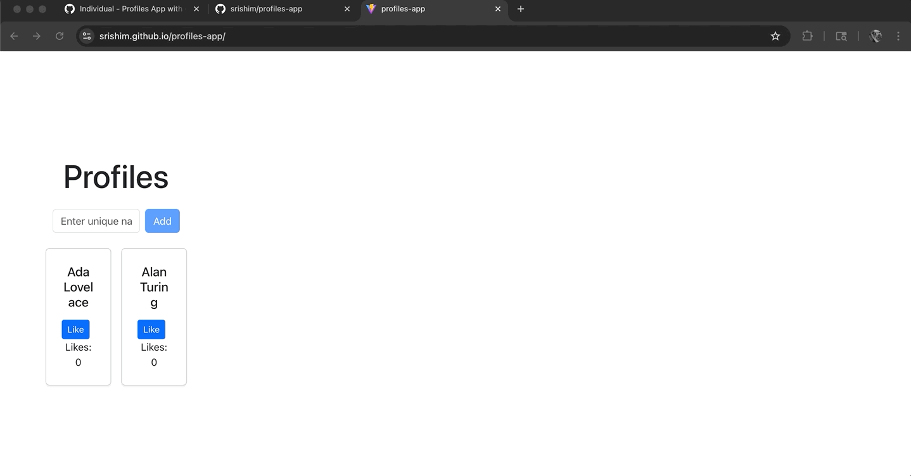

# Profiles App

A minimal **Vite + React** app styled with **React-Bootstrap**. Deployed to **GitHub Pages** via **GitHub Actions**.

---

## Live Demo (Part 2)
**https://srishim.github.io/profiles-app/**

---

## Deliverables

### Part 1 — Vite + React + React-Bootstrap
- **Commit link:** https://github.com/srishim/profiles-app/commit/5beddea0dbeb68b7f494595f3cfc5dddb4031d7f  
- **Screenshot:** 

### Part 2 — Deploy to GitHub Pages (CI)
- **Live link:** https://srishim.github.io/profiles-app/

### Part 3 — Components, Props, `.map()`
- **Commit diff:** https://github.com/srishim/profiles-app/commit/c3658ebd974f37fedbb97737e6fdc9a2e68e4275  
- **Screenshot:** 

### Part 5 — Forms & Validation
- **Demo GIF:** 

---

## Tech Stack
- React (Vite)
- React-Bootstrap, Bootstrap
- GitHub Actions (Pages)

## Getting Started
```bash
npm install
npm run dev
# open http://localhost:5173
